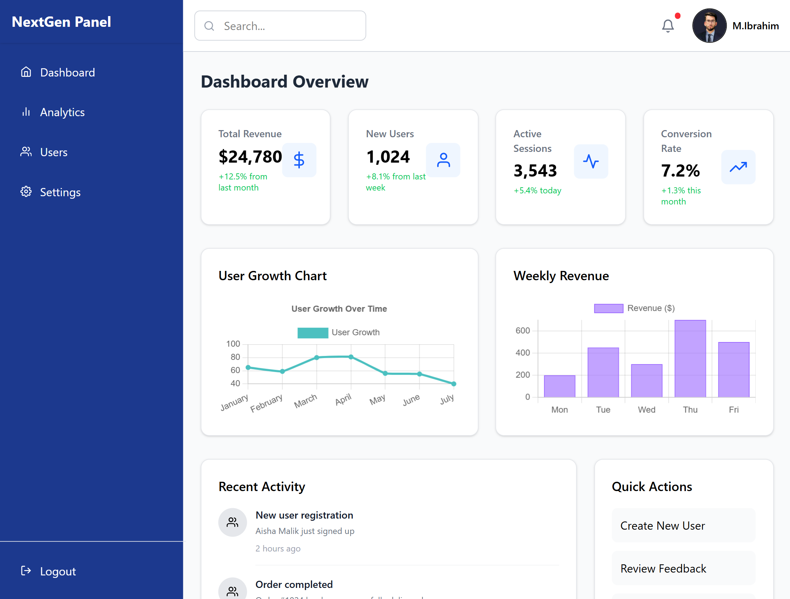

## 📊 NextGen Panel — Admin Dashboard

NextGen Panel is a modern and responsive admin dashboard built with React, Tailwind CSS, and Chart.js. It helps you visualize user data, system activity, and key performance metrics in an organized layout.

## 🚀 Features
Interactive line and bar charts

Revenue and session insights

Recent user activity feed

Quick action shortcuts

Fully responsive layout

## 🛠️ Tech Stack
React (Functional components & Hooks)

Tailwind CSS (Utility-first styling)

Chart.js via react-chartjs-2

React Icons

## 📸 Preview

   

## 📂 Getting Started
Clone the repository:

git clone https://github.com/MuhammadIbrahimkha/Admin-Dashboard.git

## Install dependencies and run:

npm install
npm install chart.js
npm install react-chartjs-2
npm install react-icons
npm install tailwindcss

npm run dev

## Author
## Muhammad Ibrahim
I'm passionate about building clean, functional, and scalable applications. Looking forward to learning and contributing to impactful projects.
